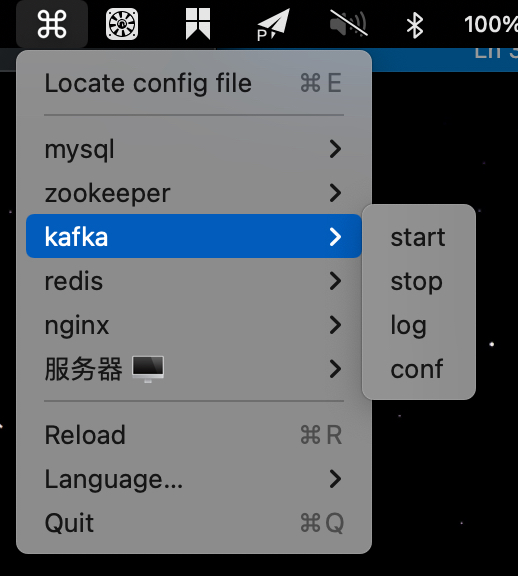

# MenubarCMD

> Aggregate executable commands in the menubar, then run them through one click

[中文文档](./README.md)


## Example




## Usage

1. Open the Finder(Cmd+E), and open the `menucmd.json` file with json-editor

```json
{
    "locale": "Display language, currently support zh-CN, en-US",
    "apps": [{
        "name": "Your application name, like MySQL, Kafka",
        "cmd": {
            "Name to describe the command, like start, stop": "Command to execute, mind if your command should run with special shell"
        }
    }]
}
```

2. Save the config file and reload(Cmd+R)


## Build

```shell
# Download dependencies
npm install
# run
npm run start
# build dmg file
npm run build
```


## 其他

参考: https://github.com/electron-in-action/clipmaster/tree/completed-example/app

文档: https://www.electronjs.org/docs/latest/

图标: https://www.iconfont.cn

图片放大: https://bigjpg.com/zh  https://www.upscale.media/upload

生成iconset: Image2icon

代码签名: https://www.jianshu.com/p/0d89a18308b2

