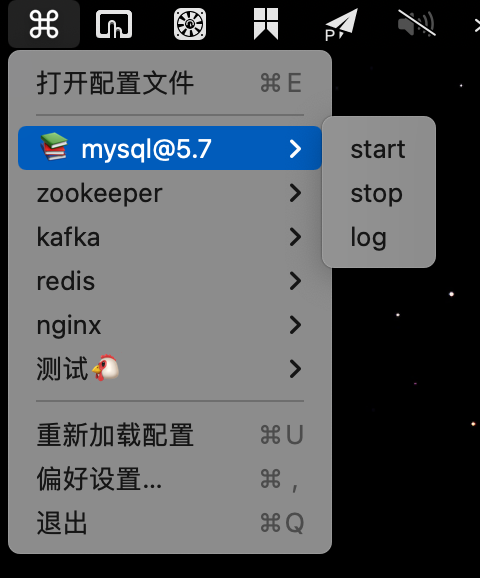

# menubarcmd

> 在菜单栏快捷执行预定义的脚本


## 示例




## 编译

```shell
# 下载依赖
npm install
# 直接运行
npm run start
# 编译安装文件
npm run build
```


## 其他

参考: https://github.com/electron-in-action/clipmaster/tree/completed-example/app

文档: https://www.electronjs.org/docs/latest/

图标: https://www.iconfont.cn

图片放大: https://bigjpg.com/zh  https://www.upscale.media/upload

生成iconset: Image2icon

