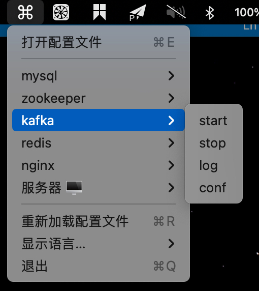

# menubarcmd

> 在菜单栏快捷执行预定义的脚本


## 示例




## 使用

1. 打开配置文件(Cmd+E), 并使用 JSON 编辑器进行编辑

```json
{
    "locale": "显示语言, 目前支持 zh-CN, en-US",
    "apps": [{
        "name": "应用名称, 例如 MySQL, Kafka",
        "cmd": {
            "命令名称或者其他显而易见的符号, 例如 start, stop": "要执行的命令, 注意如果是依赖于特定 shell 的, 需要指定"
        }
    }]
}
```

2. 重新加载配置文件(Cmd+R)


## 编译

```shell
# 下载依赖
npm install
# 直接运行
npm run start
# 编译安装文件
npm run build
```


## 其他

参考: https://github.com/electron-in-action/clipmaster/tree/completed-example/app

文档: https://www.electronjs.org/docs/latest/

图标: https://www.iconfont.cn

图片放大: https://bigjpg.com/zh  https://www.upscale.media/upload

生成iconset: Image2icon

代码签名: https://www.jianshu.com/p/0d89a18308b2

